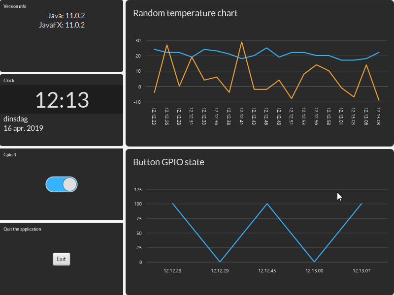

# PiJava
Experiments with the latest Java and JavaFx on Raspberry PI.

# Contents
* Code for 
    * "HelloWorld.java" --> application which can be started with Java 11 without compiling.
    * "HelloGpio.java" --> Java application interacting with the GPIO.
    * "Main.java" + "Launcher.java" --> JavaFX application using TilesFX.
* Scripts 
    * To setup Java and JavaFX on a new Raspian OS.
    * To define the PI type and related info.
    * To running the Java and JavaFX applications.

# Editor
The code has been tested with 
* IntelliJ IDEA
* Visual Studio Code

# How to build
This is a Maven project with plugins for the following commands:
* compiler:compile --> compile the code
* exec:java --> run the application from your IDE
* jar:jar --> build a .jar file which you can run on PC and Raspberry Pi
    
# More info
See articles on my blog:
https://webtechie.be/2019/04/16/pijava-overview-java-11-and-javafx-11-on-raspberry-pi
